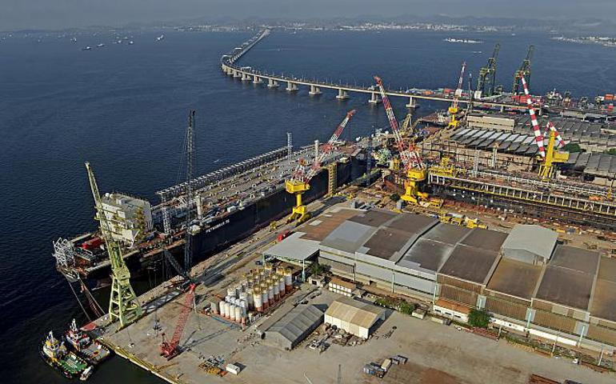

        <main>
            <section class="secao1">
                
                <a class="buttonsecao1" href="#"><button>serviços</button></a>
            </section>

            <section class="secao2">
                

                    <article class="artigosecao2">
                        <h2 class="titulosecao2">Gestão portuária integrada</h2>
                        
Simplificando suas operações
                            portuarias

                        A PortoLogistica é um sistema de gestão integrado de
                        ultima
                        geração desenvolvido para aumentar a eficiência e a
                        segurança das operações portuárias no Brasil. Nossa
                        plataforma oferece monitoramento em tempo real,
                        automação de
                        processos e análise de dados, garantindo que suas
                        necessidades de movimentação, descarga e armazenamento
                        de
                        carga sejam atendidas com precisão. Faça parceria
                        conosco
                        para obter uma solução robusta e confiável para agilizar
                        seus fluxos logísitcos.
                        
Entre em contato

                    </article>

                

                    
                

            </section>

            <section>
                <h3>Nossas soluções</h3>
                
O que esperar do nosso sistema

                

                    
                

                

                    
                

                

                    
                

            </section>
            <section id="secao4">
                

                    <h4>Atendimento e Comercial</h4>
                    
Entre em contato com a unidade:

                    

                        <figure class>
                            
                            <figcaption>niteroi</figcaption>
                        </figure>
                    

                    

                        <figure class>
                            
                            <figcaption>ilha da conceicao</figcaption>
                        </figure>
                    

                    

                        <figure>
                            
                            <figcaption>santos</figcaption>
                        </figure>
                    

                    

                        <figure>
                            
                            <figcaption>caju</figcaption>
                        </figure>
                    

                

                

                    <h5 id="faleconosco">Fale conosco</h5>
                    
Se conecte com nossos colaboradores

                    <form action="processar_formulario.php" method="POST">
                        <label for="nome">Nome:</label> 
                        <input type="text" id="nome" name="nome"
                            placeholder="Digite seu nome" required>
                          

                        <label for="email">E-mail:</label> 
                        <small>Informe um e-mail válido para
                            contato.</small> 
                        <input type="email" id="email" name="email" required>
                          

                        <label for="telefone">Telefone:</label> 
                         
                        <input type="tel" id="telefone" name="telefone"
                              

                        <label for="mensagem">MENSAGEM:</label> 
                        <textarea id="mensagem" name="mensagem" rows="4"
                            placeholder="Digite sua mensagem"></textarea>
                          

                        <button type="submit">Enviar</button>

                    </form>
                

            </section>
        </main>
        <footer>
            
[2024 Desafio produzido para fins educativos, Escola VAI NA WEB ]
                criado por @VERIATOBR

        </footer>

        .headercontent {
    display: flex;
    justify-content: space-between;
    align-items: center;
    padding: 10px 20px;
    font-family: Arial, sans-serif;
    background-color: white;
    height: 130px;
    font-family: 'Oswald';
}

.logocontent{
    font-size: 20px;
    font-weight: bold;
}

.menucontent a {
    
    margin: 0 10px;
    text-decoration: none;
    color: gray;
    font-size: 14px;
    transition: color 0.3s;
}

.menucontent a:hover {
    color: black;
}

.contatocontent .contatobotao{
    
    padding: 5px 15px;
    border: 2px solid black;
    text-decoration: none;
    color: black;
    font-size: 14px;
    transition: background-color 0.3s, color 0.3s;

}
.contatocontent .contatobotao:hover{
    background-color: black;
    color: white;
}
}
.secao1{
    .imgsecao1{
        width: 1440px;
        height: 634px;
        top: 155px;
        border: 1px;

    }

    .buttonsecao1{
    :hover{
        background-color:solid black;
    }
    padding: 5px 15px;
    border: 2px solid black;
    text-decoration: none;
    color: black;
    font-size: 14px;
    transition: background-color 0.3s, color 0.3s;
    }
}
